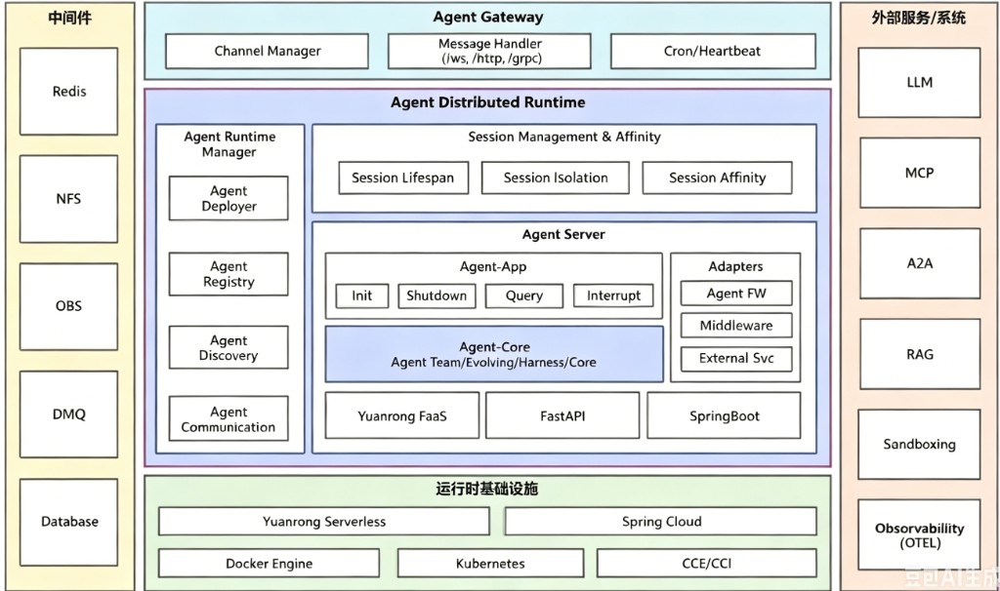

# 逻辑架构

本文描述 **openJiuwen Agent Distributed Runtime** 的整体逻辑架构（跨语言、跨进程的目标蓝图），并标注 **Agent Runtime Java** 的当前交付范围。Java 本仓实现细节见 [架构概述](架构概述.md)。

当前仓库 **`agent-runtime-java`** 主要交付 **Agent Server（② Service）**；**Agent-Core（①）** 通过 Maven 依赖独立仓库 **agent-core-java**；**Agent Runtime Manager**、完整 **Agent Gateway** 等将随 **`manager/*`** 等模块逐步补齐。平台级 Manager 模块树与运行模型将在 **`manager/*` 入仓后**于本仓库 `documents/` 补充说明。

## 架构图



逻辑分层：**中间件** ← **运行时基础设施** ← **Agent Distributed Runtime**（含 Gateway、Manager、Session、Agent Server）→ **外部服务**。箭头表示依赖方向，不是单次 HTTP 请求路径。

流程图源码（Mermaid）：`images/agent-distributed-runtime.mmd`。

## 仓库映射

| 逻辑块 | 职责 | Java 侧 |
| --- | --- | --- |
| **Agent Distributed Runtime** | 分布式运行时整体 | `agent-runtime-java` 仓库 |
| **Agent Server** | 单 Agent 可部署进程（数据面） | `service/`（`agent-service-*`） |
| **Agent-Core** | Team、Memory、图执行等 | `agent-core-java`（Maven 依赖） |
| **Agent Runtime Manager** | Deploy、Registry、Discovery | `manager/*`（规划） |
| **Agent Gateway** | 通道、多协议接入 | 机构网关（通常仓外） |
| **中间件** | Redis、NFS、OBS、DMQ、DB | `adapters-common.middleware` 等 |
| **外部服务** | LLM、MCP、A2A、RAG、Sandbox、OTEL | Core + egress + 进程内 A2A |
| **框架宿主** | 进程容器 | Spring Boot；Python 侧 FastAPI / Yuanrong FaaS |

```text
agent-runtime-java/
├── service/           → Agent Server（当前主交付）
├── manager/           → Agent Runtime Manager（规划）
└── applications/      → 平台级应用（规划）
```

---

## 分模块说明

### 中间件（左侧）

支撑运行时与控制面的基础存储与消息，由 Middleware Adapters 对接，非业务 HTTP 入口。

| 组件 | 用途 | Java 落点 |
| --- | --- | --- |
| **Redis** | Session / Task / Checkpointer 外置 | `adapters-common.middleware`、A2A `RedisTaskStore` |
| **NFS** | 共享文件、Workspace 挂载 | Manager / 平台存储（规划） |
| **OBS** | 对象存储 | External / 机构 OBS 客户端（规划） |
| **DMQ** | 异步消息、事件 | 规划 |
| **Database** | 部署元数据、审计 | Manager `DeploymentStore`（规划） |

### Agent Gateway（Runtime 上部）

统一接入面：通道管理、多协议消息处理、定时与心跳。

| 组件 | 说明 | Java 落点 |
| --- | --- | --- |
| **Channel Manager** | 多渠道接入编排 | 机构 Agent Gateway |
| **Message Handler** | ws / http / grpc | 机构网关 + 本仓 HTTP `/v1/query`、A2A JSON-RPC |
| **Cron / Heartbeat** | 定时任务、存活探测 | Manager 运维端点；Pod `GET /health` |

本仓提供 HTTP Query / health / reset 与进程内 A2A；完整 Gateway 进程不在 `service/` 内。

### Agent Runtime Manager（控制面）

| 组件 | 说明 | Java 落点 |
| --- | --- | --- |
| **Agent Deployer** | deploy / stop / 起 workload | `agent-manager-deploy`（规划） |
| **Agent Registry** | 部署记录、running URL | `DeploymentRecord`、`DeploymentStore` |
| **Agent Discovery** | 目录、list/get | Manager API；A2A Service 消费 |
| **Agent Communication** | Agent 间信令、路由元数据 | 规划；A2A 平台层 |

设计对照 Python `management/server`。deploy 后 `GatewayRegistrar` 向机构网关注册 path → backend。

### Session Management & Affinity（会话）

| 组件 | 说明 | Java 落点 |
| --- | --- | --- |
| **Session Lifespan** | 会话创建、释放、超时 | Core Session + `reset_conversation` |
| **Session Isolation** | 租户/空间/会话隔离 | Header `X-User-ID` / `X-Space-ID` |
| **Session Affinity** | 多副本粘滞 | 机构网关 sticky 或外置 Redis Session（规划） |

会话执行在 Core Checkpointer；`conversation_id` 映射在 Service Query/A2A 适配层。

### Agent Server（数据面 · `service/`）

单 Agent 可部署进程的逻辑边界。底部框架宿主支持 Spring Boot（Java）、FastAPI、Yuanrong FaaS（Python）。

| 子模块 | 能力 | 本仓模块 / 包 |
| --- | --- | --- |
| **Agent-App · Init** | 启动、Hook、就绪 | `app.lifecycle`、`AgentInitHook` |
| **Agent-App · Query** | 对话 Ingress（HTTP + A2A） | `controller.query`、`controller.a2a`、`ServeOrchestrator` |
| **Agent-App · Shutdown** | 优雅停机 | `AgentShutdownHook`、`AgentHandler.stop()` |
| **Agent-App · Interrupt** | 流式取消、A2A Cancel | `AgentLifecycleManager.interrupt`、`A2AAgentExecutor.cancel` |
| **Agent-Core** | Team / Workflow / LlmAgent 等 | Maven `agent-core-java` |
| **Adapters · Agent FW** | Handler → Runner | `adapters-agentcore.agentfw` |
| **Adapters · Middleware** | Checkpointer、Redis 客户端 | `adapters-common.middleware` |
| **Adapters · External Svc** | MCP / Remote / Sandbox 出站 | `adapters-common.external` |

```text
HTTP/A2A Ingress → ServeOrchestrator → AgentHandler → Agent-Core Runner
```

A2A：`A2aJsonRpcController` → `A2AProtocolAdapter` → 同上 Orchestrator 链。详见 [A2A 与平台边界](A2A/平台边界.md)。

### 运行时基础设施（Runtime 下部）

| 组件 | 说明 |
| --- | --- |
| **Yuanrong Serverless** | 机构 Serverless / FaaS 运行时 |
| **Spring Cloud** | 服务发现、配置（若机构采用） |
| **Docker Engine** | `mode=docker` 开发态 |
| **Kubernetes / CCE / CCI** | `mode=k8s` 生产编排 |

Manager Deployer 将对接上述 **mode**；Agent 镜像为 OCI，由 Deployer 拉起。

### 外部服务 / 系统（右侧）

经 Adapters · External Svc 或 Core 客户端出站。

| 外部能力 | 集成方式 | 状态 |
| --- | --- | --- |
| **LLM** | Core `foundation.llm` | ✅ |
| **MCP** | External Svc → Core MCP SPI | ✅ |
| **A2A** | 进程内 Server + 出站 Client | ✅ |
| **RAG** | Core retrieval | ✅ |
| **Sandboxing** | 沙箱 HTTP 服务 | ✅ |
| **Observability / OTEL** | Trace、Metrics | ⏳ |

---

## 三条主路径

### 控制面 · 部署一次

```text
CLI / REST
  → Agent Runtime Manager（Deployer）
  → Docker / K8s / subprocess 拉起 Agent Server 进程
  → Registry 写入 DeploymentRecord
  → GatewayRegistrar 登记机构网关 path → backend
```

### 数据面 · HTTP Query

```text
用户 / Client
  → 机构网关（或 dev 直连）
  → Agent Server：POST /v1/query（或 /reset_conversation）
  → ServeOrchestrator → AgentHandler → Core Runner
  →（出站）LLM / MCP / RAG / Remote / Sandbox
```

### 数据面 · 进程内 A2A

```text
A2A Client
  → GET /.well-known/agent-card.json
  → POST /a2a/（SendMessage / SendStreamingMessage）
  → A2AProtocolAdapter → ServeOrchestrator → AgentHandler → Runner
```

详见 [A2A 开发指导](A2A/开发指导.md)。平台 A2A（规划）见 [A2A 与平台边界](A2A/平台边界.md)。

---

## 关键词

> Agent 架构 · 分布式运行时 · 会话管理与亲和 · 多框架宿主 · 云原生基础设施 · 外部 AI 服务集成 · 中间件支撑

## 延伸阅读

- 本仓模块与调用链：[架构概述](架构概述.md)
- HTTP / Adapters / 生命周期：[HTTP 对话面](HTTP对话面.md)、[Adapters 与 Handler](Adapters与Handler.md)、[生命周期与探针](生命周期与探针.md)
- Service Maven 树：[service/README.md](../../../service/README.md)
- Agent Core 能力：[agent-core-java 开发指南](https://gitcode.com/openJiuwen/agent-core-java/tree/feature/630/documents/zh/2.开发指南/README.md)
- A2A 两种部署形态（独立 A2A Service vs 进程内 A2A）：[A2A 与平台边界](A2A/平台边界.md)
