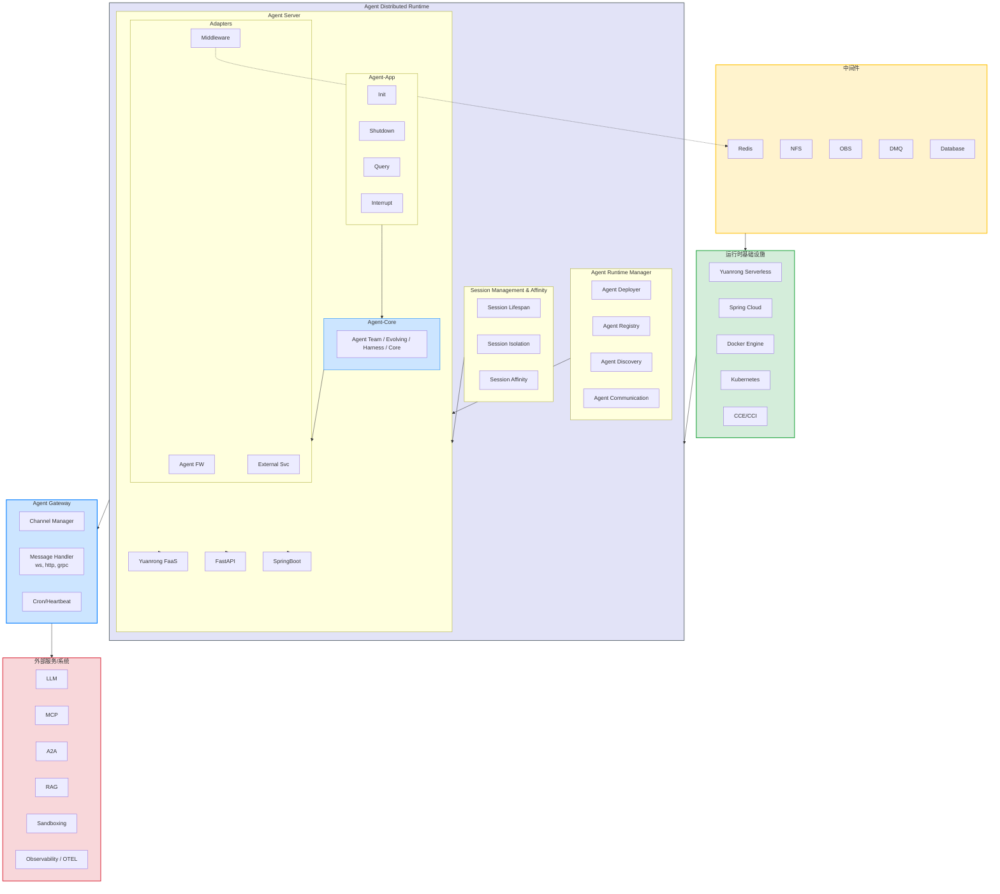

# 逻辑架构

本文描述 **openJiuwen Agent Runtime（Java）** 的目标逻辑架构：从左到右为 **中间件**、**核心运行时与网关**、**外部服务/系统**。  
当前仓库 **`agent-runtime-java`** 主要交付 **Agent Server（② Service）**；**Agent-Core（①）** 通过 Maven 依赖独立仓库 **agent-core-java**；**Agent Runtime Manager**、完整 **Agent Gateway** 等将随 **`manager/*`** 等模块逐步补齐。平台级 Manager 模块树与运行模型将在 **`manager/*` 入仓后**于本仓库 `documents/` 补充说明。

---

## 1. 整体布局

```text
┌──────────────┬────────────────────────────────────────────────────┬──────────────┐
│  中间件       │     Agent Gateway + Agent Distributed Runtime      │  外部服务     │
│  Middleware  │     网关 + 分布式运行时                              │  External    │
└──────────────┴────────────────────────────────────────────────────┴──────────────┘
```

| 区域 | 职责 | 典型组件 |
| --- | --- | --- |
| **左侧 · 中间件** | 存储、消息、文件等基础能力 | Redis、NFS、OBS、DMQ、Database |
| **中间 · 运行时** | 接入、控制面、会话、Agent 执行、底座 | Gateway、Manager、Session、Agent Server、Infra |
| **右侧 · 外部** | 模型、协议、检索、沙箱、可观测 | LLM、MCP、A2A、RAG、Sandboxing、OTEL |

---

## 2. 架构总图（Mermaid）

结构与原始架构图一致：**中间件 → 基础设施 → Distributed Runtime → Gateway → 外部服务**；Runtime 内嵌 Manager、Session、Agent Server（App / Core / Adapters + 框架宿主）。



**相对你提供的草稿，语法上主要改了这些**（否则易报 `Mermaid Syntax Error`）：

| 问题 | 处理 |
| --- | --- |
| subgraph 名 `Middleware` 与 Adapters 内节点 `Middleware` **ID 冲突** | subgraph 改为 `MiddlewareLayer`；Adapters 内节点改为 `MwAdapter` |
| 子图标题含 `&`、`/`、中文 | 统一用 `subgraph id ["标题"]` 引号形式 |
| 节点 `CCE/CCI`、`Cron/Heartbeat` 等含 `/` | 改为 `CCECCI["CCE/CCI"]` 等带引号标签 |
| 节点 `A2A` 易与语法关键字混淆 | 改为 `A2ANode[A2A]` |
| `graph TD` | 改为 `flowchart TD`（与当前 Mermaid 推荐写法一致） |
| `style Middleware` | 改为 `style MiddlewareLayer` 与 subgraph ID 一致 |

**读图说明**：

- 大箭头表示**逻辑分层依赖**（与原图左→中→右区域对应），不是单次 HTTP 请求路径。
- **本仓已实现**主要集中在 `Agent Server` 内 **Agent-App + Adapters + Agent-Core（Submodule）**；Manager、完整 Gateway 进程为规划模块。
- `MwAdapter -.-> Redis` 表示 Adapters · Middleware 对接左侧中间件（示意，非唯一连线）。

---

## 3. 分模块说明

### 3.1 中间件（左侧）

支撑运行时与控制面的 **基础存储与消息**，由 **Middleware Adapters** 与 Manager / Core SPI 对接，非业务 HTTP 入口。

| 组件 | 用途 | Java 落点（目标） |
| --- | --- | --- |
| **Redis** | Session / Task / Checkpointer 外置、缓存 | `adapters.middleware`、A2A TaskStore（平台） |
| **NFS** | 共享文件、Workspace 挂载 | Manager / 平台存储（规划） |
| **OBS** | 对象存储 | External / 机构 OBS 客户端 |
| **DMQ** | 异步消息、事件 | 规划 |
| **Database** | 部署元数据、审计 | Manager `DeploymentStore` |

**本仓现状**：`adapters-common` 已预留 **middleware / external** 包结构；Redis Checkpointer 等待落地。

---

### 3.2 Agent Gateway（中间上部）

统一 **接入面**：通道管理、多协议消息处理、定时与心跳。

| 组件 | 说明 | Java 落点 |
| --- | --- | --- |
| **Channel Manager** | 多渠道接入编排 | 机构 **Agent Gateway** 或 JiuwenClaw 类产品（旁路） |
| **Message Handler** | `/ws`、`/http`、`/grpc` | 网关 + Service **C-013** `/query` |
| **Cron / Heartbeat** | 定时任务、存活探测 | Manager 运维端点；Pod `/health` |

**本仓现状**：Agent Service 提供 **HTTP Query / health**；完整 Gateway 进程 **不在** `service/` 内。生产 **JWT/IAM + C-010 路由** 在机构统一网关。

---

### 3.3 Agent Distributed Runtime（中间核心）

#### 3.3.1 Agent Runtime Manager（控制面）

| 组件 | 说明 | Java 落点 |
| --- | --- | --- |
| **Agent Deployer** | deploy / stop / 起 workload | `agent-manager-deploy`（规划） |
| **Agent Registry** | 部署记录、running URL | `DeploymentRecord`、`DeploymentStore` |
| **Agent Discovery** | 目录、list/get | Manager API；A2A Service 消费 |
| **Agent Communication** | Agent 间信令、路由元数据 | 规划；A2A 平台层 |

**本仓现状**：**未实现**；设计对照 Python `management/server`。deploy 后 **`GatewayRegistrar`** 向机构网关注册 path → backend。

#### 3.3.2 Session Management & Affinity（会话）

| 组件 | 说明 | Java 落点 |
| --- | --- | --- |
| **Session Lifespan** | 会话创建、释放、超时 | Core Session + `reset_conversation` |
| **Session Isolation** | 租户/空间/会话隔离 | Header `X-User-ID` / `X-Space-ID`；C-007 NS |
| **Session Affinity** | 多副本粘滞 | **机构网关 sticky** 或 **外置 Redis Session**（C-018） |

**本仓现状**：会话执行在 **Core Checkpointer**；`conversation_id` 映射在 Service Query/A2A 适配层。`agent-manager-dispatch`（实例池）**暂缓 M3**。

#### 3.3.3 Agent Server（数据面 · 本仓主交付）

单 Agent OCI 进程内的 **Agent-App + Agent-Core + Adapters**。

| 子模块 | 能力 | 本仓模块 / 包 |
| --- | --- | --- |
| **Agent-App · Init** | 启动、Hook、就绪 | `app.lifecycle`、`AgentInitHook` |
| **Agent-App · Shutdown** | 优雅停机 | `AgentShutdownHook`、`AgentHandler.stop()` |
| **Agent-App · Query** | 对话 Ingress | `controller.query`、`ServeOrchestrator` |
| **Agent-App · Interrupt** | 流式中断 | `AgentLifecycleManager.interrupt`（无 REST） |
| **Agent-Core** | Team / Evolving / Harness / Core | Maven `agent-core-java`（独立仓库） |
| **Adapters · Agent FW** | Handler → Runner | `adapters-agentcore`、`agentcore-ext`、`versatile` |
| **Adapters · Middleware** | Redis 等接线 | `adapters-common.middleware`（规划实现） |
| **Adapters · External Svc** | LLM/MCP/HTTP 出站 | `adapters.*.external` |
| **框架宿主** | 运行时容器 | **Spring Boot**（本仓）；FastAPI 对标 Python；元戎 FaaS 为机构扩展 |

**调用链（数据面不变量）**：

```text
Query Controller → ServeOrchestrator → AgentHandler → Agent-Core Runner
（禁止 Controller 直连 Runner）
```

#### 3.3.4 运行时基础设施（中间下部）

| 组件 | 说明 |
| --- | --- |
| **Yuanrong Serverless** | 机构 Serverless / FaaS 运行时 |
| **Spring Cloud** | 服务发现、配置（若机构采用） |
| **Docker Engine** | `mode=docker` 开发态 |
| **Kubernetes / CCE / CCI** | `mode=k8s` 生产编排 |

**本仓现状**：Manager Deployer 将对接上述 **mode**；Agent 镜像为 **OCI**，由 Deployer 拉起。

---

### 3.4 外部服务 / 系统（右侧）

经 **Adapters · External Svc** 或 Core 客户端出站，非进程内实现。

| 外部能力 | 集成方式 | 本仓现状 |
| --- | --- | --- |
| **LLM** | Core `foundation.llm` | ✅ Maven `agent-core-java` |
| **MCP** | External Svc SPI | ⏳ adapters.external |
| **A2A** | 平台 A2A Service + Client | ⏳ 独立进程；Agent **无** 进程内 A2A Server |
| **RAG** | Core retrieval | ✅ Core |
| **Sandboxing** | 沙箱服务 | ⏳ 平台 / Runtime 叙事 |
| **Observability / OTEL** | Trace、Metrics | ⏳ 横切待统一 |

---

## 4. 本仓库模块映射

```text
agent-runtime-java（当前 + 规划）
├── service/                        → Agent Server（Agent-App + Adapters 胶水）
│   ├── agent-service-spec
│   ├── agent-service-adapters/*
│   ├── agent-service-app           → Agent-App（Init/Shutdown/Query/Interrupt）
│   └── agent-service-demo
├── manager/（规划）                → Agent Runtime Manager
│   ├── agent-manager-foundation
│   ├── agent-manager-deploy
│   ├── agent-manager-server
│   ├── agent-manager-integration   → GatewayRegistrar 等
│   └── agent-manager-cli
└── applications/（规划）           → 平台 A2A Service 等
```

| 逻辑架构块 | 仓库路径 | 状态 |
| --- | --- | --- |
| Agent-Core | Maven `com.openjiuwen:agent-core-java` | ✅ 独立仓库 |
| Agent-App | `service/agent-service-app` | ✅ |
| Adapters | `service/agent-service-adapters` | ✅ 部分（FW 为主） |
| Agent Runtime Manager | `manager/*` | ⏳ 未入仓 |
| Agent Gateway（完整） | 机构网关 + 可选产品 Gateway | 🔌 外部 / 旁路 |
| 中间件对接 | `adapters.middleware` | ⏳ 结构已有 |
| 外部服务出站 | `adapters.external` | ⏳ Versatile 等少量 |

---

## 5. 三条主路径（动态视图）

### 5.1 控制面 · 部署一次

```text
CLI / REST
  → Agent Runtime Manager（Deployer）
  → Docker / K8s / subprocess 拉起 Agent Server 进程
  → Registry 写入 DeploymentRecord
  → GatewayRegistrar 登记机构网关 path → backend
  →（可选）A2A Service 刷新目录
```

### 5.2 数据面 · 每次对话（M1 默认）

```text
用户 / Client
  → 机构网关（或 dev 直连）
  → Agent Server：Query
  → ServeOrchestrator → AgentHandler → Core Runner
  →（出站）LLM / MCP / RAG / Versatile HTTP
```

**不经过** Manager；**不经过** 完整 Agent Gateway 产品进程（若已走机构网关则已含接入能力）。

### 5.3 平台 A2A（规划）

```text
A2A Client
  → 平台 A2A Service（右侧 A2A 能力的产品化）
  → Agent Server POST /query
```

详见 [A2A 与平台边界](A2A与平台边界.md)。

---

## 6. ASCII 简图（便于手绘对照）

```text
┌─────────┬──────────────────────────────────────────────┬─────────┐
│ Redis   │  Channel Mgr │ MsgHandler │ Cron/Heartbeat   │  LLM    │
│ NFS     ├──────────────────────────────────────────────┤  MCP    │
│ OBS     │ Deployer │ Registry │ Discovery │ Communic.  │  A2A    │
│ DMQ     │ Session Lifespan │ Isolation │ Affinity      │  RAG    │
│ Database│ Init│Shutdown│Query│Interrupt │ Core │ Adapters│ Sandbox │
│         │      SpringBoot / FastAPI / Yuanrong FaaS     │  OTEL   │
│         │ Yuanrong Serverless │ Spring Cloud            │         │
│         │ Docker │ Kubernetes │ CCE/CCI                 │         │
└─────────┴──────────────────────────────────────────────┴─────────┘
   中间件              Agent Distributed Runtime              外部服务
```

---

## 7. 关键词

> Agent 架构 · 分布式运行时 · 会话管理与亲和 · 多框架宿主 · 云原生基础设施 · 外部 AI 服务集成 · 中间件支撑

## 8. 延伸阅读

- 本仓模块与调用链：[架构概述](架构概述.md)
- Service Maven 树：[service/README.md](../../service/README.md)
- Agent Core 能力：[agent-core-java 开发指南](https://gitcode.com/openJiuwen/agent-core-java/tree/0.1.12/documents/zh/2.开发指南/README.md)
- A2A 两种部署形态（独立 A2A Service vs 进程内 A2A）：[A2A 与平台边界](A2A与平台边界.md)
