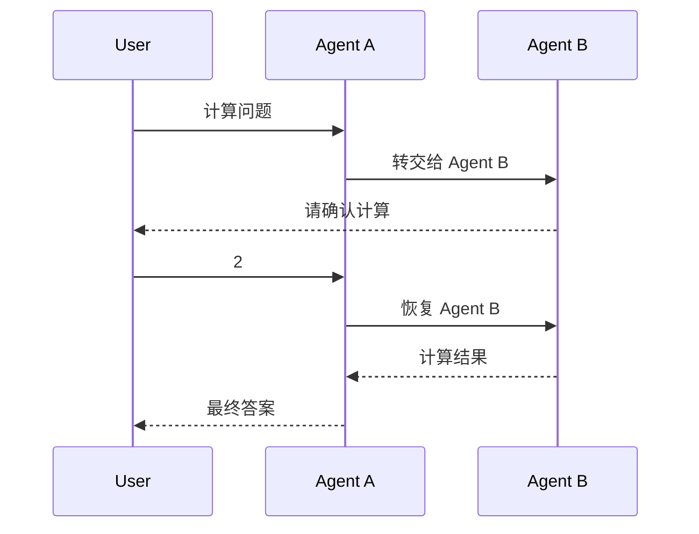
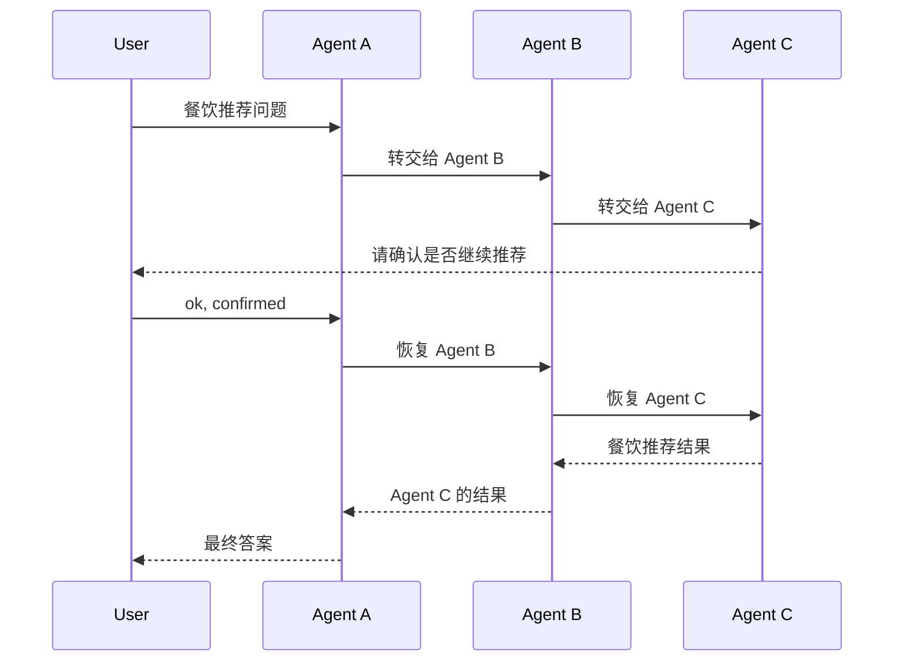

# A2A Multi-Agent 示例

本示例演示三个独立 Agent 如何通过 A2A 协议协作完成一次用户请求，并在需要用户确认时完成中断与恢复。

- **Agent A**：用户入口。所有问题都先转交给 Agent B。
- **Agent B**：任务路由。计算类问题在本地处理；餐饮类问题转交给 Agent C。
- **Agent C**：餐饮助手。给出餐饮推荐前先请求用户确认。

| Agent   | 端口    | 角色                          |
|---------|-------|-----------------------------|
| Agent A | 18090 | 接收用户请求并转交 Agent B           |
| Agent B | 18091 | 区分问题类型：计算走本地工具，餐饮转交 Agent C |
| Agent C | 18092 | 餐饮推荐助手，返回推荐前触发确认            |

> 运行本示例需要配置真实的大模型 API，因为 Agent A 和 Agent B 会根据请求自主选择工具。

## 示例场景

### 场景一：计算问题，只触发 Agent A -> Agent B

用户问：

```text
What is 1+1? Use Agent B's ordinary calc path.
```

预期行为：



Agent B 会在执行计算前请求用户确认，确认后返回计算结果。

### 场景二：餐饮问题，触发 Agent A -> Agent B -> Agent C

用户问：

```text
Recommend a dish for a team lunch. Let Agent C provide the food recommendation after confirmation.
```

预期行为：



这一场景展示三 Agent 协作：Agent B 识别餐饮问题后转交 Agent C，最终中断由 Agent C 触发。

## 快速开始

### 1. 配置大模型 API

任选一种方式配置三个 Agent 共享的大模型 API。使用本地配置文件时，请在仓库的 `service` 目录执行命令。

**方式 A：本地配置文件**

```bash
cp agent-service-demo/example/config/application-base_local.example.yml \
   agent-service-demo/example/config/application-base_local.yml
# 编辑 application-base_local.yml，填写 openjiuwen.service.llm 下的 api-key / api-base / model-name
```

**方式 B：apiconfig.json**

```bash
export OPENJIUWEN_API_CONFIG=/path/to/apiconfig.json
```

PowerShell：

```powershell
$env:OPENJIUWEN_API_CONFIG="C:\path\to\apiconfig.json"
```

**方式 C：环境变量**

```bash
export OPENJIUWEN_SERVICE_LLM_API_KEY=...
export OPENJIUWEN_SERVICE_LLM_API_BASE=...
export OPENJIUWEN_SERVICE_LLM_MODEL_NAME=...
```

### 2. 运行 smoke 脚本

smoke 脚本会自动启动 Agent C、Agent B 和 Agent A，完成验证后关闭服务。运行脚本前不需要手动启动 Agent。

Linux / Git Bash：

```bash
bash /path/to/agent-runtime-java/service/agent-service-demo/example/a2a/smoke-a2a.sh
```

PowerShell：

```powershell
& "C:\path\to\agent-runtime-java\service\agent-service-demo\example\a2a\smoke-a2a.ps1"
```

两个脚本都可以从任意工作目录调用。显式设置相对路径 `OPENJIUWEN_API_CONFIG` 时，路径相对于调用脚本时的工作目录解析；未设置时，脚本会自动使用仓库内已有的 `service/agent-service-demo/apiconfig.json`。

脚本按 Agent C -> Agent B -> Agent A 的顺序启动服务，等待健康状态，验证 Agent Card 和以下两条路径：

1. 计算问题：Agent A -> Agent B，两轮确认后完成。
2. 餐饮问题：Agent A -> Agent B -> Agent C，两轮确认后完成。

验证成功后，脚本会清理进程和临时文件；验证失败时会输出并保留日志目录。

## 手动启动

如需逐步调试示例，请在仓库的 `service` 目录打开三个终端，并按 Agent C -> Agent B -> Agent A 的顺序启动。

终端 1：

```bash
mvn -pl agent-service-demo/example/a2a -am spring-boot:run \
  -Dspring-boot.run.main-class=com.openjiuwen.service.demo.example.a2a.A2aAgentCDemoApplication
```

终端 2：

```bash
mvn -pl agent-service-demo/example/a2a -am spring-boot:run \
  -Dspring-boot.run.main-class=com.openjiuwen.service.demo.example.a2a.A2aAgentBDemoApplication
```

终端 3：

```bash
mvn -pl agent-service-demo/example/a2a -am spring-boot:run \
  -Dspring-boot.run.main-class=com.openjiuwen.service.demo.example.a2a.A2aAgentADemoApplication
```

启动后检查健康状态：

```bash
curl -s http://localhost:18092/health
curl -s http://localhost:18091/health
curl -s http://localhost:18090/health
```

## 手动验证

### Agent Card

```bash
curl -s http://localhost:18090/.well-known/agent-card.json | python3 -m json.tool
curl -s http://localhost:18091/.well-known/agent-card.json | python3 -m json.tool
curl -s http://localhost:18092/.well-known/agent-card.json | python3 -m json.tool
```

### REST：计算问题（A -> B）

Round 1：

```bash
curl -s -X POST http://localhost:18090/v1/query \
  -H 'Content-Type: application/json' \
  -d '{
    "conversation_id": "a2b-calc-001",
    "message": "What is 1+1? Use Agent B ordinary calc path.",
    "stream": false
  }' | python3 -m json.tool
```

预期：返回等待确认的响应。

Round 2：

```bash
curl -s -X POST http://localhost:18090/v1/query \
  -H 'Content-Type: application/json' \
  -d '{
    "conversation_id": "a2b-calc-001",
    "message": "2",
    "stream": false
  }' | python3 -m json.tool
```

预期：返回计算结果。

### REST：餐饮问题（A -> B -> C）

Round 1：

```bash
curl -s -X POST http://localhost:18090/v1/query \
  -H 'Content-Type: application/json' \
  -d '{
    "conversation_id": "a2b2c-food-001",
    "message": "Recommend a dish for a team lunch. Let Agent C provide the food recommendation after confirmation.",
    "stream": false
  }' | python3 -m json.tool
```

预期：返回 Agent C 发起的确认请求。

Round 2：

```bash
curl -s -X POST http://localhost:18090/v1/query \
  -H 'Content-Type: application/json' \
  -d '{
    "conversation_id": "a2b2c-food-001",
    "message": "ok, confirmed",
    "stream": false
  }' | python3 -m json.tool
```

预期：返回 Agent C 的餐饮推荐，并由 Agent A 汇总给用户。

### A2A SSE：计算问题（A -> B）

Round 1：

```bash
curl -s -N -X POST http://localhost:18090/a2a \
  -H 'Content-Type: application/json' \
  -H 'Accept: text/event-stream' \
  -d '{
    "jsonrpc": "2.0", "id": 1,
    "method": "SendStreamingMessage",
    "params": {
      "message": {
        "role": "ROLE_USER", "contextId": "calc-sse-001",
        "parts": [{"text": "What is 1+1? Use Agent B ordinary calc path."}]
      }
    }
  }'
```

预期：SSE 事件流进入 Agent B 的计算确认中断后关闭，等待用户确认。

Round 2：

```bash
curl -s -N -X POST http://localhost:18090/a2a \
  -H 'Content-Type: application/json' \
  -H 'Accept: text/event-stream' \
  -d '{
    "jsonrpc": "2.0", "id": 2,
    "method": "SendStreamingMessage",
    "params": {
      "message": {
        "role": "ROLE_USER", "contextId": "calc-sse-001",
        "parts": [{"text": "ok"}]
      }
    }
  }'
```

预期：恢复同一会话并返回计算结果。

### A2A SSE：餐饮问题（A -> B -> C）

以下请求通过 SSE 访问 Agent A，并完成三 Agent 协作。

Round 1：

```bash
curl -s -N -X POST http://localhost:18090/a2a \
  -H 'Content-Type: application/json' \
  -H 'Accept: text/event-stream' \
  -d '{
    "jsonrpc": "2.0", "id": 1,
    "method": "SendStreamingMessage",
    "params": {
      "message": {
        "role": "ROLE_USER", "contextId": "food-sse-001",
        "parts": [{"text": "Recommend a dish for a team lunch. Let Agent C provide the food recommendation after confirmation."}]
      }
    }
  }'
```

预期：SSE 事件流进入 `INPUT_REQUIRED` 后关闭，等待用户确认。

Round 2：

```bash
curl -s -N -X POST http://localhost:18090/a2a \
  -H 'Content-Type: application/json' \
  -H 'Accept: text/event-stream' \
  -d '{
    "jsonrpc": "2.0", "id": 2,
    "method": "SendStreamingMessage",
    "params": {
      "message": {
        "role": "ROLE_USER", "contextId": "food-sse-001",
        "parts": [{"text": "ok, confirmed"}]
      }
    }
  }'
```

预期：恢复同一会话并返回最终餐饮推荐。

## 可选：使用 Redis 保存会话

默认使用内存存储。若希望跨进程保留会话和任务状态，可以启用 Redis。

在仓库的 `service` 目录创建本地配置：

```bash
cp agent-service-demo/example/a2a/application-a2a-redis.example.yml \
   agent-service-demo/example/a2a/application-a2a-redis.local.yml
```

编辑 `application-a2a-redis.local.yml`，按单机 Redis 填写 `host` / `port` / 密码，或按 Redis Cluster 填写 `type: cluster` 和 `nodes`。三个 Agent 启动时会自动加载该配置。

启动后可用以下命令观察任务 key：

```bash
redis-cli KEYS "a2a:task:*"
```
